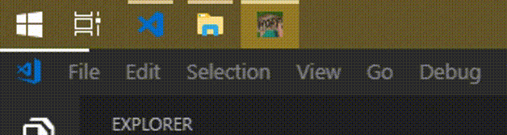

# Hope

DT小工具系列 / DT Tools

一款用于时间管理的小工具 

预览

项目地址

https://github.com/UkiyoESoragoto/hope

https://gitee.com/UkiyoESoragoto/hope

图标原图：

《龙珠·改》
另一个未来的布尔玛在时光机器上写下的HOPE

---

软件创意来自新浪微博某用户，他制作过一个C#版本，名叫"盼头"……嗯，我记不得了在哪儿看的了

可以在屏幕最上方显示一根白色的进度条，提示距离死线已经消耗了多少时间。
简洁，非侵入式占屏，十分友好。
及时提醒用户注意时间，提高效率，充满正能量。

A lite tool for hope, it will remind you when you will get off work.
A hope for go home.

---

### 使用说明 / How to use

按下 Cmd + r 加速（刷新）

按下 Cmd + , 打开设置

按下 Cmd + q 退出

请在Linux系统下使用Ctrl键替换Cmd

Windows下没有快捷键

Press Cmd + r to speed up(refresh)

Press Cmd + , to open settings

Press Cmd + q to quit

Use Ctrl key to replace Cmd on Linux

---

### 常见问题/FAQ

- DT小工具是什么意思？ / 是英文 Do it 的缩写，意思是行动，包含了积极向上的含义 `(๑•̀ㅂ•́)و✧`
- What is DT? / DT for Dan Teng in Chinese, means bored `_(:з」∠)_` 

- 为什么是白色？ / 因为你不能改
- Why white? / I like it

- 加速有什么用？/ 可以提醒用户时间紧迫
- What is 'Speed up' for? / For run faster to make you feel you can go home early

 
- 不是说过就算死，从这跳下去，死外面，都不写桌面程序吗？/ 真香！
- Translate server error / Awesome!

---

# 下载地址

[Github](https://github.com/UkiyoESoragoto/hope/releases/)

[Gitee](https://gitee.com/UkiyoESoragoto/hope/releases/)
